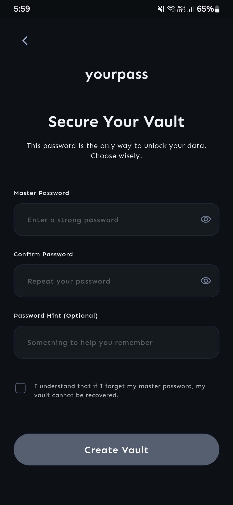
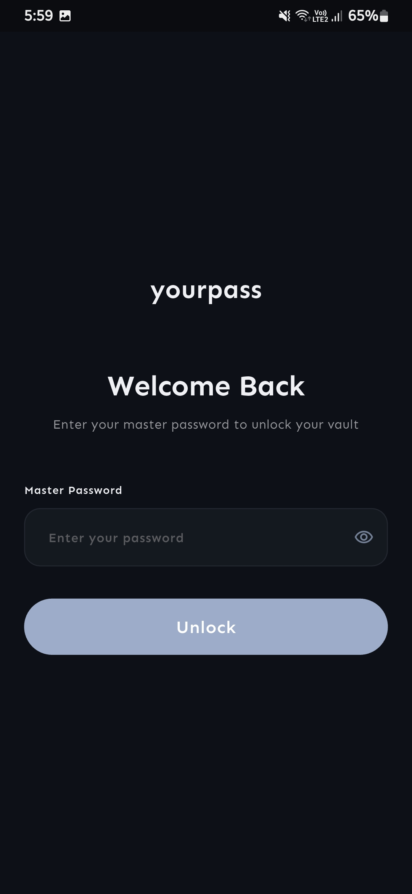
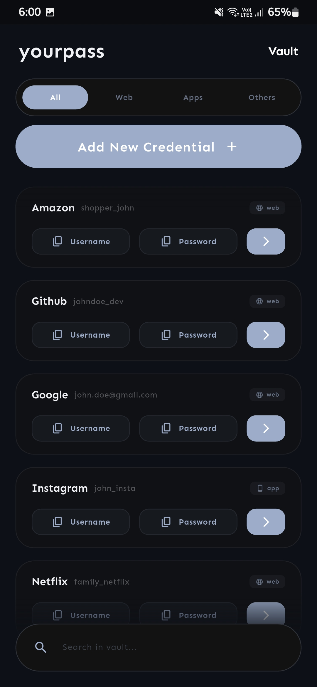
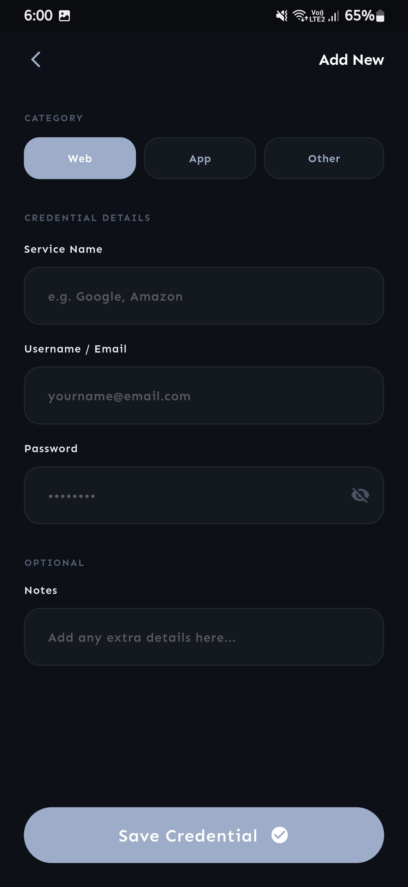
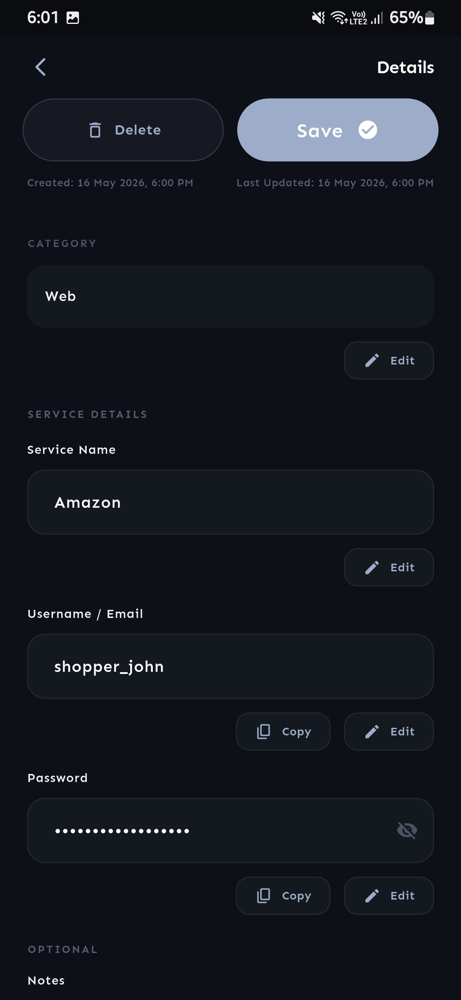
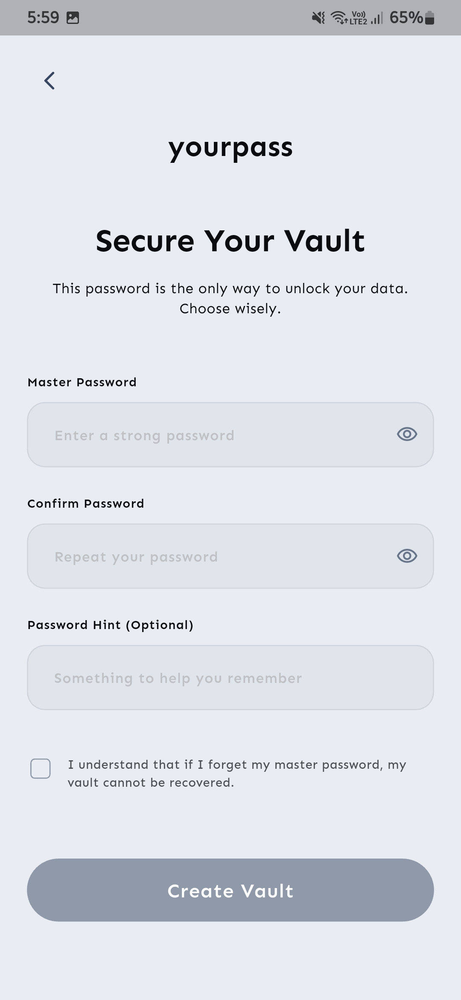
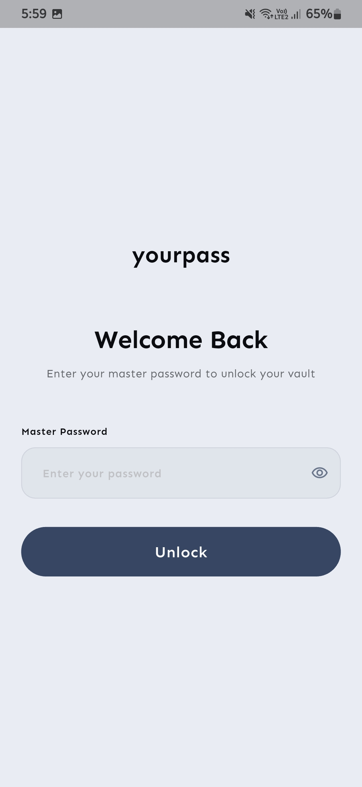
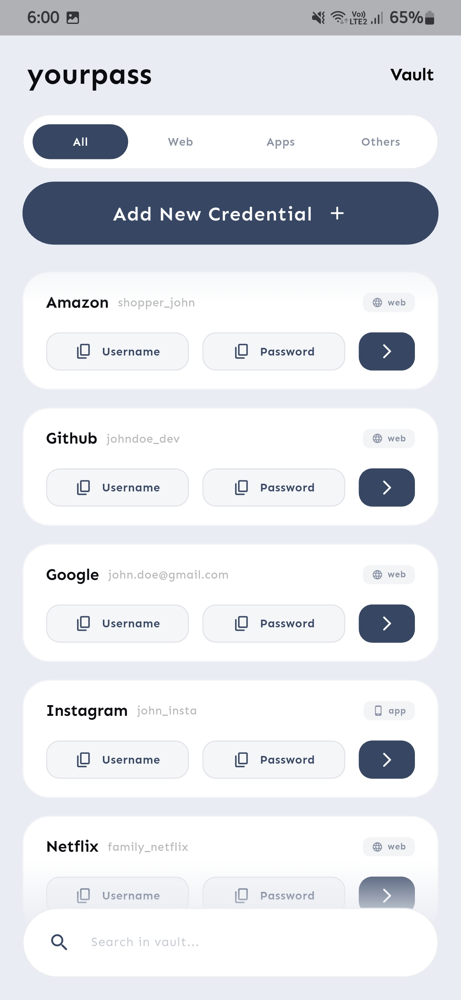
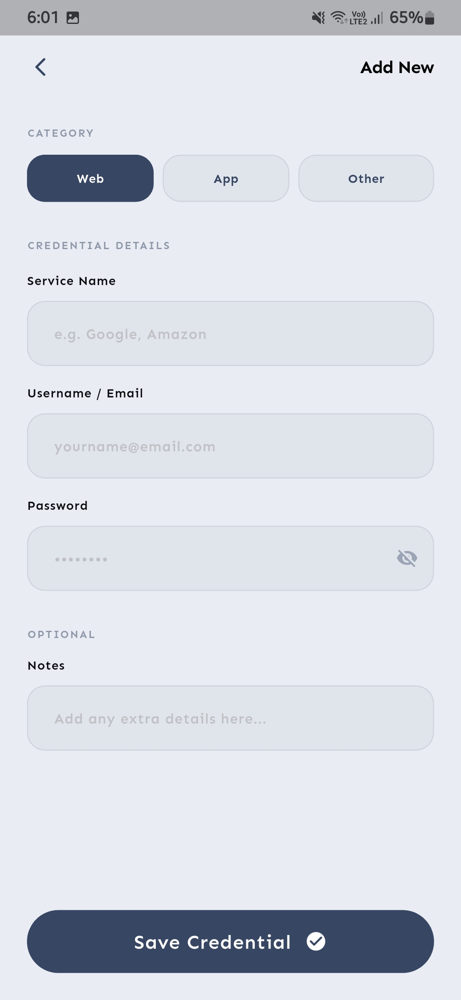
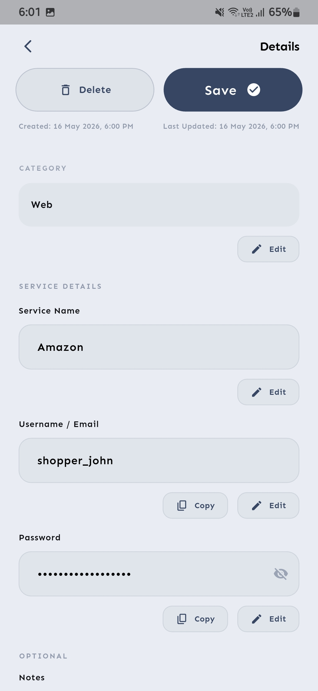

<p align="center">
  <picture>
    
  </picture>
</p>

<p align="center">
  
  
  
  
  
</p>

---

YourPass is a **privacy first** and **offline password manager** built for privacy. All your credentials are stored locally on your device — no cloud sync, no telemetry, no internet required.

> [!NOTE]
> **The UI is fully built, and core security features are being actively implemented.**

---

## Features

- **Master password derived key encryption** — Your vault is encrypted using a key derived from your master password. Without it, your data stays locked.
- **Fully offline** — Your credentials never leave your device. No accounts, no servers, no subscription.
- **Search & categorize** — Filter by category (Web, App, Other) or search by title and username.
- **One-tap copy** — Tap to copy usernames and passwords. A quick confirmation lets you know it worked.
- **Light & dark mode** — Seamlessly follows your system theme out of the box.
- **Add, view, edit, delete** — Full CRUD for all your credentials.

---

## Screenshots

### Dark mode

<p align="center">
  
  
  
  
  
</p>

### Light mode

<p align="center">
  
  
  
  
  
</p>

---

## Building from source

```bash
git clone https://github.com/Arvind-Sabarinathan/yourpass.git
cd yourpass
flutter pub get
flutter run
```

Requirements: Flutter SDK 3.11.5 or later.

---

## Privacy

YourPass collects **no data**. There is no analytics SDK, no crash reporter, no network calls. It is designed to work completely offline — you can even use it on a device in airplane mode.

---

## Contributing

Contributions are welcome and appreciated.

1. Fork the repository
2. Create a branch for your feature (`git checkout -b feature/amazing-idea`)
3. Commit your changes
4. Open a pull request

Found a bug or have an idea? [Open an issue](https://github.com/Arvind-Sabarinathan/yourpass/issues).
